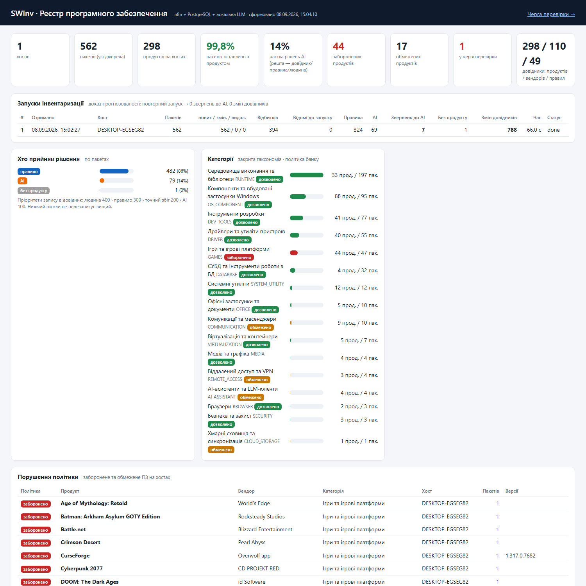
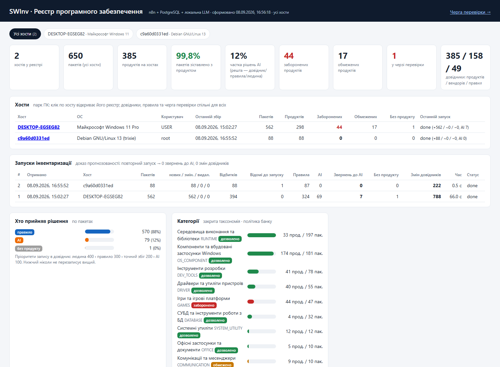
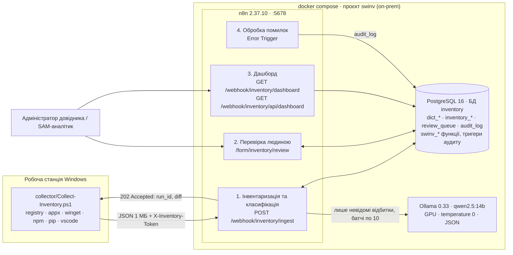
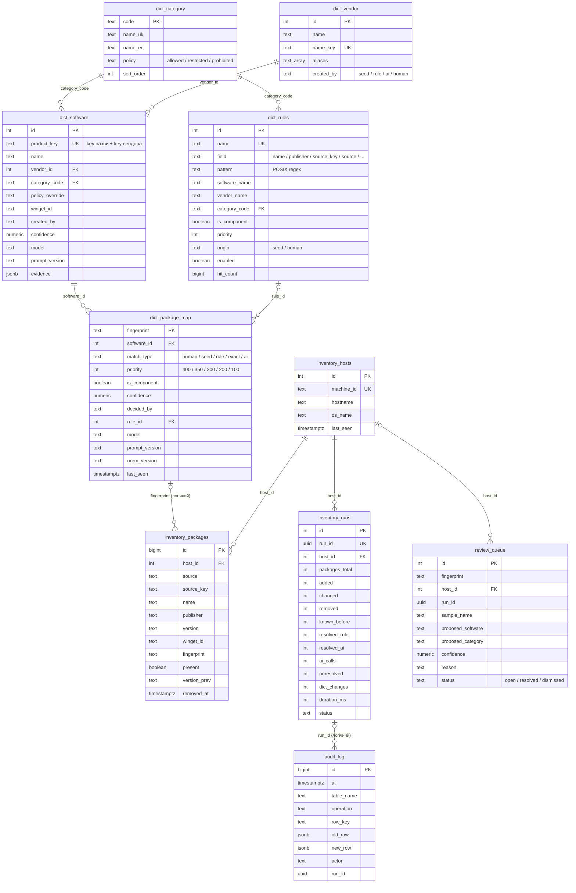

# SWInv — інвентаризація ПЗ робочих станцій та AI-класифікація

**Тестове завдання для ПриватБанку (Low-code developer / n8n).** Робочий прототип: PowerShell-колектор → n8n → довідники в PostgreSQL ↔ локальна LLM (Ollama). Розгортається однією командою і працює повністю всередині периметра.

- **Пакети — «до гвинтика».** Один скрипт без зовнішніх модулів збирає ПЗ із 6 джерел (реєстр Uninstall HKLM64/HKLM32/HKCU, MSIX/Appx, winget, npm, pip, розширення VS Code): 562 пакети за 8,3 с на тестовому ПК.
- **AI лише там, де без нього не обійтись.** Спочатку довідник, потім правила (regex у Postgres), і тільки залишок — у LLM батчами по 10. На першому запуску 324 із 394 відбитків закрито без AI, 70 — моделлю.
- **Прогнозованість, яку видно.** Повторний запуск на тому ж ПК: 0 нових / 0 змінених / 0 видалених, 0 звернень до AI, 0 змін довідників — рядок підсвічено зеленим на дашборді.
- **Довідники живуть у БД і оновлюються за правилами.** Пріоритети рішень human 400 › seed 350 › rule 300 › exact 200 › ai 100, upsert із захистом від пониження, аудит кожної зміни тригером БД, рішення людини перетворюються на правила.
- **On-prem за замовчуванням.** qwen2.5:14b на локальній GPU, temperature 0, JSON-режим; дані не залишають машину. Перехід на хмарну модель — одна нода на канвасі (вже стоїть поруч, вимкнена).
- **Парк ПК, а не один хост.** Windows- і Linux/macOS-колектори з одним контрактом, спільні довідники; дашборд має перемикач хостів, таблицю парку і блок «що змінилось на хості за останній збір».



Парк із двох хостів (Windows + Linux-контейнер) на одному дашборді зі спільними довідниками:



---

## 1. Як закрито пункти завдання

| Вимога банку | Де реалізовано | Що подивитись |
|---|---|---|
| **1. Отримати перелік встановленого ПЗ детально по пакетах, будь-яким доступним методом** | `collector/Collect-Inventory.ps1` — 6 джерел, кожне ізольоване (збій джерела не зупиняє збір), UTF-8 JSON за контрактом `docs/CONTRACT-collector.md` (schema 1.0), POST на `/webhook/inventory/ingest` з заголовком `X-Inventory-Token` | `samples/inventory-sample.json` (562 пакети, 1 МБ); блок `sources[]` зі статистикою кожного джерела |
| **2. Аналіз через n8n і AI: відповідність пакетів → ПЗ, визначення категорій** | Воркфлоу `SWInv · 1. Інвентаризація та класифікація`: нормалізація `norm_v1` → крок 1 точні збіги → крок 2 правила `dict_rules` → крок 3 AI (Basic LLM Chain + Ollama + JSON Schema) → валідація → запис. Категорія живе на **продукті** (`dict_software`), пакети згортаються в продукти через `dict_package_map` | Канвас воркфлоу 1 (5 смуг зі sticky-нотатками); дашборд «Продукти з найбільшою кількістю пакетів»: VC++ Redistributable 23 пакети → 1 продукт |
| **3. Прогнозовані результати; довідники створюються і коректно оновлюються** | Стабільний відбиток пакета, детерміновані кроки перед AI, temperature 0 + закрита таксономія + пороги впевненості, пріоритети запису `ON CONFLICT … WHERE EXCLUDED.priority >= priority`, аудит тригером, форма людини-в-контурі, лічильники кожного запуску в `inventory_runs` | Таблиця «Запуски інвентаризації» на дашборді: другий запуск = 0 звернень до AI, 0 змін довідників; розділ 8 цього документа |

---

## 2. Архітектура



Стек: n8n 2.37.10 · PostgreSQL 16 (дві БД в одному інстансі: `n8n` — метадані n8n, `inventory` — наша) · Ollama з GPU (перевірено на RTX 4090) · модель `qwen2.5:14b`. Усі три сервіси в одному `docker-compose.yml`, проєкт `swinv`.

---

## 3. Швидкий старт

Вимоги: Windows 10/11, Docker Desktop (WSL2) з підтримкою NVIDIA GPU, ~12 ГБ вільного місця (модель ≈ 9 ГБ), PowerShell 5.1+.

```powershell
git clone https://github.com/kostyantyn94/swinv.git
cd swinv

# 1) Увесь стек однією командою (ідемпотентно; -Reset — з нуля, стирає volumes)
powershell -ExecutionPolicy Bypass -File .\setup.ps1

# 2) Зібрати ПЗ з цього ПК і надіслати в n8n
powershell -NoProfile -ExecutionPolicy Bypass -File .\collector\Collect-Inventory.ps1
```

Що робить `setup.ps1`: перевіряє/запускає Docker → створює `.env` зі свіжими секретами (з `.env.example`) → `docker compose up -d` → створює БД `inventory`, застосовує `db/schema.sql` і `db/seed.sql` → створює власника n8n через REST → імпортує credentials (CLI) → імпортує та активує 4 воркфлоу (CLI) і перезапускає n8n → завантажує й прогріває модель → smoke-тест: POST `samples/inventory-sample.json` і очікування статусу `done` → друкує URL-и.

Параметри колектора: `-WebhookUrl` (типово `http://localhost:5678/webhook/inventory/ingest`), `-Token` (типово з `.env` → `INVENTORY_WEBHOOK_TOKEN`), `-OutFile`, `-NoUpload`, `-Sources registry,appx,…`, `-Quiet`. Коди виходу: 0 — ок, 1 — не зібрано жодного пакета, 2 — не вдалося надіслати (файл усе одно записано в `samples/inventory-<host>-<timestamp>.json`).

**Межі збору (exclude-списки).** Обидва колектори читають `collector/exclude.txt` і, за наявності, локальний `collector/exclude.local.txt` (локальні файли `*.local.*` не комітяться): один регулярний вираз на рядок, збіг перевіряється проти `<назва> | <видавець> | <шлях встановлення>`. Пакети, що збіглися, не потрапляють у payload. Типові сценарії для банку: BYOD-пристрої (особисте ПЗ співробітника поза обліком), тестові збірки вендорів, внутрішні інструменти, які обліковуються іншою системою.

### Linux і macOS

Серверна частина не залежить від ОС; для інших платформ є bash-колектор із тим самим контрактом і bash-варіант bootstrap:

```bash
# стек на Linux/macOS-хості (docker compose v2, curl)
./setup.sh                      # --reset, --skip-model-pull, --skip-smoke

# збір ПЗ на Linux/macOS і відправка в n8n
./collector/collect-inventory.sh --webhook-url http://<n8n-host>:5678/webhook/inventory/ingest --token <INVENTORY_WEBHOOK_TOKEN>
```

Джерела bash-колектора визначаються автоматично: `dpkg`, `rpm`, `apk`, `pacman`, `snap`, `flatpak`, `brew` / `brew-cask`, `macos-app` (бандли в `/Applications`), `pip`, `npm`, `vscode`. Пакети дистрибутива за seed-правилом потрапляють в `OS_COMPONENT`, відомі сервери БД, інструменти розробки, контейнери, VPN тощо — у свої категорії, решта (snap/flatpak/cask/застосунки macOS) — до AI. Перевірено в контейнері `ubuntu:22.04`: 116 пакетів dpkg за 2 с, другий хост з'являється на тому ж дашборді зі спільними довідниками.

GPU для Ollama вмикається окремим файлом `docker-compose.gpu.yml` (NVIDIA): `setup.ps1` / `setup.sh` самі додають `COMPOSE_FILE=docker-compose.yml:docker-compose.gpu.yml` у `.env`, коли бачать NVIDIA runtime у Docker. Без GPU Ollama працює на CPU (повільніше); на macOS зручніше запустити Ollama нативно і вказати `OLLAMA_BASE_URL=http://host.docker.internal:11434`.

| Що | URL |
|---|---|
| Редактор n8n | http://localhost:5678 — логін `admin@swinv.local`, пароль у `.env` (`N8N_OWNER_PASSWORD`) |
| Дашборд (HTML) | http://localhost:5678/webhook/inventory/dashboard — увесь парк; `?host=<id>` — один ПК із блоком змін за останній збір |
| Дашборд (JSON API) | http://localhost:5678/webhook/inventory/api/dashboard (той самий параметр `host`) |
| Форма перевірки | http://localhost:5678/form/inventory/review |
| Ollama API | http://localhost:11434 |
| PostgreSQL | `localhost:5432`, користувач/пароль з `.env`, БД `inventory` |

---

## 4. Структура репозиторію

```
swinv\                              ← корінь репозиторію (після git clone)
├── README.md                       ← цей документ
├── setup.ps1                       ← bootstrap однією командою, Windows (-Reset, -SkipModelPull, -SkipSmoke)
├── setup.sh                        ← те саме для Linux / macOS (--reset, --skip-model-pull, --skip-smoke)
├── reset.ps1                       ← чистий стан для репетиції (-KeepModel зберігає завантажену модель)
├── docker-compose.yml              ← n8n + postgres + ollama, проєкт swinv
├── docker-compose.gpu.yml          ← override для NVIDIA GPU (вмикається через COMPOSE_FILE у .env)
├── .env.example                    ← шаблон секретів (.env створюють setup-скрипти)
├── collector\
│   ├── Collect-Inventory.ps1       ← колектор Windows: 6 джерел → JSON → POST на webhook
│   └── collect-inventory.sh        ← колектор Linux / macOS: dpkg, rpm, apk, pacman, snap, flatpak, brew, macOS apps, pip, npm, vscode
├── db\
│   ├── schema.sql                  ← таблиці, функції swinv_*, тригери аудиту, подання (ідемпотентно)
│   ├── seed.sql                    ← 17 категорій з політиками, 13 вендорів з аліасами, 37 правил
│   └── init\01-create-inventory-db.sh ← створення БД inventory при першому старті Postgres
├── n8n\
│   ├── build_workflows.py          ← генератор 4 воркфлоу (промпт, валідація, пороги — тут)
│   ├── code\normalize.js           ← norm_v1: нормалізація і відбиток (вставляється в Code-ноду)
│   ├── code\dashboard.js           ← рендер HTML-дашборду з одного JSON
│   ├── credentials\credentials.template.json ← Postgres / Ollama / header-token з фіксованими id
│   └── workflows\
│       ├── 01-ingest-classify.json ← SWInv · 1. Інвентаризація та класифікація
│       ├── 02-review-form.json     ← SWInv · 2. Перевірка людиною (форма)
│       ├── 03-dashboard.json       ← SWInv · 3. Дашборд реєстру ПЗ
│       └── 04-error-handler.json   ← SWInv · 4. Обробка помилок
├── scripts\
│   ├── demo-plant-unknown-app.ps1  ← демо: «встановити» невідому програму (HKCU, без прав адміна)
│   └── demo-remove-unknown-app.ps1 ← демо: прибрати її
├── samples\
│   └── inventory-sample.json       ← офлайн-зразок з тестового ПК (562 пакети)
└── docs\
    ├── ARCHITECTURE.md             ← компоненти, контракти, послідовність, рішення
    ├── DEMO.md                     ← сценарій демонстрації на 12–15 хв
    ├── CONTRACT-collector.md       ← контракт payload колектора (v1.0)
    ├── dashboard.png               ← знімок дашборду після першого запуску
    └── BUILD-NOTES.md              ← перевірені технічні нотатки по n8n 2.37
```

---

## 5. Потік обробки (воркфлоу 1, 7 кроків)

Назви нод — як на канвасі.

1. **Приймання.** `Webhook: POST /inventory/ingest` (Header Auth `X-Inventory-Token`; хибний токен → HTTP 403) → `Валідація payload`: `schema_version = "1.0"`, `host.machine_id`, `run_id`, непорожній `packages[]`, у кожного пакета є `source`, `source_key`, `name`.
2. **Нормалізація.** `Нормалізація (norm_v1)` — для кожного пакета обчислюються `name_clean`, `name_normalized`, `publisher_normalized` і **відбиток** `fingerprint` (розділ 6).
3. **Знімок і diff.** `БД: хост + запуск` (`swinv_upsert_host_run`) → `БД: пакети + diff (jsonb, set-based)` (`swinv_ingest_packages`: один `INSERT … ON CONFLICT (host_id, source, source_key)`, підрахунок added/changed/removed, зниклі пакети → `present = false`) → `Відповідь колектору (202 Accepted)` з `{accepted, run_id, host_id, diff}`. Далі воркфлоу працює асинхронно.
4. **Крок 1 — точні збіги.** `БД: крок 1 — точні збіги (довідник)` (`swinv_match_exact`): відбитки, що вже є в `dict_package_map`, лише отримують `last_seen`; нові відбитки з `winget_id` відомого продукту закриваються як `exact`.
5. **Крок 2 — правила.** `БД: крок 2 — правила (dict_rules)` (`swinv_apply_rules`): regex-правила з таблиці (`~*`, поле `name` / `publisher` / `source_key` / `source` / …) за спаданням `priority`; створюють вендора і продукт, пишуть зіставлення `rule`, інкрементують `hit_count`.
6. **Крок 3 — AI лише для залишку.** `Довідник категорій` (закритий перелік з `dict_category`) → `БД: крок 3 — невідомі (для AI)` (`swinv_unresolved`, по одному зразку на відбиток) → `Є невідомі пакети?` → `Пакетування (по 10, відсортовано)` → `Цикл по батчах` → `Промпт для AI` → `AI: класифікація (Basic LLM Chain)` з під-нодами `Ollama Chat Model (локально, GPU)` і `Структурований вивід (JSON Schema)` → `Валідація відповіді AI` → `Відповідь валідна?` → `БД: запис результатів AI (пріоритет ai=100)` (`swinv_apply_ai_results`) або `БД: батч у чергу перевірки (AI недоступний / невалідно)` (`swinv_ai_failed`).
7. **Фіналізація.** `БД: фіналізація запуску (лічильники)` (`swinv_finalize_run`: `unresolved`, `dict_changes`, `duration_ms`, `status = done`) → `Підсумок запуску`.

Інші воркфлоу: **2** — форма перевірки (`Форма: почати перевірку` → `БД: взяти запис із черги` → `Побудова форми (категорії з довідника)` → `Форма: рішення рецензента` → `Розбір рішення` → `БД: застосувати рішення (human=400 + правило + аудит)` → `Форма: збережено`); **3** — дашборд (`swinv_dashboard()` → `Рендер HTML` / JSON); **4** — `Помилка будь-якого воркфлоу SWInv` → `БД: запис у audit_log`.

---

## 6. Довідники

### 6.1 Таблиці

| Таблиця | Призначення | Ключ / особливості |
|---|---|---|
| `dict_category` | Закрита таксономія (17 категорій) + політика банку `allowed / restricted / prohibited` | `code` PK; AI не може створити категорію |
| `dict_vendor` | Канонічні вендори | `name_key` UNIQUE (нормалізований), `aliases[]`, `created_by` seed/rule/ai/human |
| `dict_software` | Канонічні продукти — **одиниця обліку; категорія живе тут** | `product_key` UNIQUE = `swinv_key(назва) \| ключ вендора`; `policy_override`, `winget_id`, `confidence`, `model`, `prompt_version`, `evidence` |
| `dict_rules` | Правила детермінованого зіставлення як дані | `name` UNIQUE; `field`, `pattern` (POSIX regex), `priority`, `origin` seed/human, `enabled`, `hit_count` |
| `dict_package_map` | Відбиток пакета → продукт (пам'ять системи) | `fingerprint` PK; `match_type` + `priority`; `decided_by`, `rule_id`, `model`, `prompt_version`, `norm_version`, зразок пакета |
| `inventory_hosts` | Хости | `machine_id` UNIQUE (MachineGuid) |
| `inventory_runs` | Запуски з лічильниками — доказ прогнозованості | `run_id` UNIQUE; added/changed/removed, known_before, resolved_exact/rule/ai, ai_calls, unresolved, dict_changes, duration_ms, status |
| `inventory_packages` | Поточний стан пакетів по хостах | UNIQUE (`host_id`, `source`, `source_key`); `present`, `version_prev`, `removed_at` |
| `review_queue` | Черга для людини | один `open` запис на відбиток; `reason` low_confidence / unknown_category / invalid_output / ai_unavailable / manual |
| `audit_log` | Кожна зміна довідників (тригер) + помилки воркфлоу | `old_row`, `new_row`, `actor`, `run_id` |

Подання: `v_inventory_current` (пакет + продукт + політика), `v_software_by_host` (згортання пакетів у продукти), `v_policy_violations`.

### 6.2 ERD



### 6.3 Як саме оновлюються довідники

**Відбиток (`norm_v1`, `n8n/code/normalize.js`).** Стабільні ідентифікатори мають пріоритет: `appx|<PackageFamilyName>`, `vscode|…`, `npm|…`, `pip|…`, `steam|<Steam App N>`; інакше `source|назва без версії, розрядності й локалі|ключ вендора без Inc./LLC/ТОВ`. Однаковий пакет у будь-якій версії → один відбиток → один запис довідника → жодного повторного звернення до AI. На тестовому ПК 562 пакети → 394 відбитки. `swinv_vendor_key()` у SQL дзеркалить `vendorKey()` у JS.

**Пріоритети запису (`dict_package_map`).** `swinv_priority()`: human 400 › seed 350 › rule 300 › exact 200 › ai 100. Усі функції пишуть через

```sql
ON CONFLICT (fingerprint) DO UPDATE SET … WHERE EXCLUDED.priority >= dict_package_map.priority
```

тобто AI ніколи не перезапише правило чи людину, а людина перекриває будь-що (`swinv_apply_rules`, `swinv_apply_ai_results`, `swinv_apply_human_decision` у `db/schema.sql`).

**Продукти і вендори.** `swinv_vendor_id(name, created_by)` шукає за `name_key` або в `aliases`, інакше створює запис із позначкою, хто його створив. Продукт має ключ `swinv_key(назва) || '|' || ключ вендора`; правила й AI роблять `INSERT … ON CONFLICT (product_key) DO NOTHING` (перший, хто назвав продукт, фіксує канон), людина може змінити категорію продукту (`ON CONFLICT DO UPDATE` у `swinv_apply_human_decision`).

**Правила.** Seed-правила з `db/seed.sql` (upsert за `name`, тому повторний `setup.ps1` не дублює). З форми перевірки людина може створити правило точного збігу: `field = name`, `pattern = '^' || swinv_regex_escape(назва) || '$'`, `priority 500`, `origin human` — воно спрацює для будь-якого нового відбитка з такою назвою (інший хост, інше написання видавця) раніше за всі seed-правила. `hit_count` / `last_hit_at` оновлюються при кожному спрацюванні.

**Аудит.** Тригер `trg_audit_<table>` (`swinv_audit_trigger`) на всіх п'яти `dict_*` таблицях пише `old_row`/`new_row`/`actor`/`run_id` у `audit_log`; актор виставляється на час транзакції через `swinv_set_actor()` (`collector`, `exact`, `rule`, `ai:<модель>`, `human:<хто>`, `seed`). Технічні зміни (`updated_at`, `last_seen`, `hit_count`, `last_hit_at`) не логуються, тому «нічого не змінилось» дає рівно 0 рядків. `inventory_runs.dict_changes` = кількість рядків аудиту з цим `run_id`.

**Перекласифікація накопичених рішень.** У кожному запуску правила застосовуються з `include_mapped = true`: вони перекривають рішення `ai`/`exact` того ж відбитка, але ніколи `human`/`seed` — той самий захист пріоритетів, тож правило завжди старше за модель незалежно від порядку появи. Для всього парку одразу є `swinv_reclassify(host_id, reset_ai, prompt_version)` (воркфлоу 5, `POST /webhook/inventory/reclassify`). Рішення людини з форми поширюється на парк автоматично: створене правило проганяється по всіх хостах за його `rule_id` (не весь набір правил), тому це один легкий запит навіть на великому парку. З `reset_ai` рішення AI (усі або зі старим `prompt_version`) видаляються з фіксацією `old_row` в аудиті, і наступний збір запитує модель повторно; `GET /webhook/inventory/api/consistency` порівнює старі й нові відповіді.

**Черга перевірки.** Один відкритий запис на відбиток (частковий унікальний індекс). Відбитки, що чекають на людину (`low_confidence`, `unknown_category`, `manual`), до AI повторно не надсилаються; технічні збої (`ai_unavailable`, `invalid_output`) — повторюються при наступному запуску і закриваються автоматично з `resolved_by = 'ai-retry'`.

---

## 7. Чому результати прогнозовані, а AI не «галюцинує» в довідники

| # | Механізм | Де в коді | Як побачити на демо |
|---|---|---|---|
| 1 | **Стабільний відбиток пакета** — без версії, розрядності, локалі; стабільні id (PackageFamilyName, Steam App, npm/pip/vscode) мають пріоритет | `n8n/code/normalize.js` → нода `Нормалізація (norm_v1)` | 562 пакети → 394 відбитки; після оновлення версії програми AI не викликається (`changed = N`, `ai_calls = 0`) |
| 2 | **Довідник — перший**: відомий відбиток не доходить до AI | `swinv_match_exact`, `swinv_unresolved` (`NOT EXISTS … dict_package_map`) | Другий запуск: `known_before 393` (394 мінус один відбиток у черзі перевірки), `ai_calls 0` |
| 3 | **Правила як дані** — детермінований regex у Postgres, редагується без зміни воркфлоу | `dict_rules`, `swinv_apply_rules`, `db/seed.sql` (37 правил) | 324 відбитки закрито без AI; картка «Правила зіставлення» з `hit_count` |
| 4 | **AI отримує лише невідоме, по одному зразку на відбиток** | `swinv_unresolved` (`DISTINCT ON fingerprint`) | 70 відбитків → 7 батчів, а не 562 запитів |
| 5 | **Детермінований промпт**: батчі відсортовані за відбитком, `temperature 0`, `topK 1`, JSON-режим, `keepAlive 24h` | `JS_BATCH`, нода `Ollama Chat Model (локально, GPU)` у `n8n/build_workflows.py` | Однаковий вхід → однаковий вихід; час батчу ≈ 9 с |
| 6 | **Закрита таксономія з двох боків**: перелік категорій підвантажується з `dict_category` у промпт, а JSON Schema парсера містить `enum` кодів; `UNKNOWN` — легальний спосіб сказати «не знаю» | нода `Довідник категорій`, `OUTPUT_SCHEMA`, `Структурований вивід (JSON Schema)` | Preptail 1.8.0 → `UNKNOWN`, впевненість 0.05 → черга з причиною «категорія поза переліком», а не вигадана категорія |
| 7 | **Echo-back id**: кожен вхідний id має повернутись рівно раз; відповіді без id відкидаються, пакети без відповіді — у чергу; якщо повернуто менше половини — весь батч `invalid_output` | нода `Валідація відповіді AI` (`JS_VALIDATE_AI`) | Промпт «ids 1..N»; на дашборді причина «некоректна відповідь AI» |
| 8 | **Пороги впевненості**: ≥ 0.80 прийняти; 0.60–0.80 прийняти **і** показати людині; < 0.60 або `OTHER` — лише в чергу; порожня назва продукту — `invalid_output` | `ACCEPT = 0.80`, `ACCEPT_REVIEW = 0.60` у `JS_VALIDATE_AI` | Колонка «Впевн.» у черзі перевірки |
| 9 | **AI пише з найнижчим пріоритетом** і ніколи не перезаписує правило чи людину | `swinv_priority`, `ON CONFLICT … WHERE EXCLUDED.priority >= priority` | Картка «Хто прийняв рішення» + підпис про пріоритети |
| 10 | **Аудит на рівні рядка БД** — обійти з n8n неможливо; технічні зміни не шумлять | `swinv_audit_trigger`, `trg_audit_*` | `dict_changes = 788` на першому запуску і `0` на другому; картка «Журнал аудиту» |
| 11 | **Атомарність кроків**: кожен крок — одна SQL-функція в одній транзакції, set-based (`jsonb_to_recordset`) | `swinv_ingest_packages`, `swinv_apply_rules`, `swinv_apply_ai_results` | Відсутність «напівзаписаних» станів; 562 пакети — один запит, відповідь колектору за ~0,35 с |
| 12 | **Ідемпотентність прийому**: `UNIQUE (host_id, source, source_key)`, повторний `run_id` того самого файлу → новий запуск (`client_run_id` зберігає оригінал), зникле → `present = false`, а не `DELETE` | `swinv_ingest_packages`, `swinv_upsert_host_run` | Повторний POST того самого файлу → `0 / 0 / 0` |
| 13 | **Збій AI не ламає запуск**: retry 2× (3 с), потім error-вихід ноди → батч у чергу з `ai_unavailable`; статус запуску `done`; наступний запуск повторить лише технічні збої | `retryOnFail`, `onError: continueErrorOutput`, `swinv_ai_failed`, `swinv_unresolved` | Зупинити `swinv-ollama` → запуск завершується, черга наповнюється; підняти → наступний запуск закриває їх (`resolved_by = ai-retry`) |
| 14 | **Людина в контурі**: рішення `human = 400` + опційне правило точного збігу `priority 500` — AI більше не питають | `swinv_apply_human_decision`, воркфлоу 2 | Форма → «Збережено ✔ … Створено правило #N»; рядок у «Правила зіставлення» з `origin human` |
| 15 | **Версіонування й перекласифікація**: `norm_version`, `prompt_version`, `model`, `confidence`, `evidence` поруч із кожним рішенням; `swinv_reclassify` застосовує нові правила заднім числом і може скинути рішення `ai` зі старим `prompt_version`, не чіпаючи правила й людей | `dict_package_map`, `swinv_reclassify`, воркфлоу 5 | Додати правило → `POST /inventory/reclassify` → рішення AI перекрито, рішення людини лишилось; звіт `/inventory/api/consistency` |
| 17 | **Echo-back назви пакета**: модель повертає `id` і `name`; якщо назва не збігається з вхідною (переплутані рядки в батчі), відповідь іде в чергу, а не в довідник | `JS_VALIDATE_AI` | Причина «некоректна відповідь AI» у черзі перевірки |
| 16 | **Помилки воркфлоу теж у журналі** | воркфлоу 4 `Помилка будь-якого воркфлоу SWInv` → `audit_log` (`table_name = n8n_workflow`) | Картка «Журнал аудиту» |

---

## 8. Результати на тестовому ПК

| Показник | Значення |
|---|---|
| Зібрано пакетів | **562** за ~8 с: registry 364, appx 175, vscode 18, winget 2 (окремо; ще 283 рядки winget приєднано до registry/appx як `winget_id`), npm 2, pip 1 |
| Відповідь webhook | HTTP 202 за ~0,35 с, тіло `{accepted, run_id, diff:{added, changed, removed}}` |
| Унікальних відбитків | **394** |
| Закрито без AI (довідник + правила) | **324** |
| Надіслано в AI | 70 відбитків → 7 батчів по ≤ 10 |
| Результат AI | 69 прийнято, 1 у чергу (Preptail 1.8.0 — `UNKNOWN`, 0.05: модель коректно відмовилась вгадувати) |
| Тривалість першого запуску | 66 с (≈ 9 с на батч на RTX 4090) |
| Записів аудиту за перший запуск | 788 |
| Згортання пакетів у продукти | 562 пакети → ≈ 298 продуктів на хості |
| Стабільність AI без довідника | скинуто 69 рішень AI (`reset_ai`) і зібрано повторно: 20 відбитків закрились без моделі точним збігом з уже відомим продуктом, 1 пішов у чергу, 48 модель вирішила повторно — категорія збіглась у 93,8 %, назва продукту у 79,2 % (розбіжності — варіанти написання на кшталт «Gothic 2» / «Gothic II»). Відсотки рахуються лише по повторних рішеннях моделі, кеш продуктів у них не входить; саме тому канон назви фіксує довідник, а не модель |
| **Другий запуск (той самий ПК)** | added 0 / changed 0 / removed 0, `known_before 393`, **`ai_calls 0`, `dict_changes 0`**, ≈ 0,3 с — рядок зелений |

Приклади згортання:

| Продукт | Пакетів → продуктів |
|---|---|
| Microsoft Visual C++ Redistributable | 23 → 1 |
| Microsoft SQL Server | 21 → 1 |
| Windows SDK | 16 → 1 |
| Python | 11 → 1 |
| Microsoft Office | 6 → 1 |

Політики на цьому ПК: 44 **заборонених** продукти (категорія GAMES — ігри Steam, лаунчери); **обмежені**: Claude, Copilot, Grok (AI_ASSISTANT), Discord (COMMUNICATION), Meta Horizon Link (REMOTE_ACCESS). Політика задається на категорії (`dict_category.policy`) і може бути перекрита для окремого продукту (`dict_software.policy_override`).

---

## 9. Безпека та on-prem

- Уся обробка локальна: колектор → n8n → Postgres → Ollama в одній docker-мережі. Назви ПЗ, хости, користувачі не залишають машину. Нода `OpenAI Chat Model (альтернатива, вимкнено)` присутня лише як задокументований варіант заміни.
- Webhook приймає лише запити з правильним `X-Inventory-Token` (n8n Header Auth; інакше 403). Токен генерується `setup.ps1` і живе в `.env` (у git — лише `.env.example`).
- Редактор n8n — за логіном власника; телеметрія, шаблони й банери n8n вимкнені (`N8N_DIAGNOSTICS_ENABLED=false` тощо).
- Аудит незалежний від n8n: тригер БД фіксує зміну довідника, ким би вона не була зроблена (у т.ч. вручну через psql).
- Колектор працює без прав адміністратора (Appx — для поточного користувача; з підвищенням — `-AllUsers`), не змінює систему, лише читає.

---

## 10. Обмеження та наступні кроки

**Чесно про обмеження прототипу**

- Перевірено на одному хості. Мультихост закладено (`machine_id`, `UNIQUE (host_id, source, source_key)`, спільні довідники, дашборд групує по хостах), але не тестовано на парку.
- Джерело `winget` залежить від встановленого winget і парсингу його табличного виводу; джерело опційне — без нього збір працює.
- Seed-правила відлагоджені на цьому ПК; це дані (`dict_rules`), а не код — їх треба доповнювати під парк банку.
- Якість моделі: `qwen2.5:14b` локально; трапляються дискусійні категорії (наприклад, ігровий оверлей як DEV_TOOLS). Саме для цього є черга перевірки, пріоритет людини і правила з її рішень.
- Webhook захищений лише заголовком-токеном (без HMAC-підпису тіла), TLS у локальному демо немає, форма перевірки відкрита без авторизації n8n.

**Наступні кроки**

1. Парк ПК: розгортання колектора через GPO/Intune як scheduled task з `-WebhookUrl` центрального n8n; n8n у queue-режимі з воркерами; `OLLAMA_NUM_PARALLEL` > 1.
2. HMAC-підпис payload (секрет + `run_id` + timestamp) і TLS через reverse proxy.
3. Grafana поверх `v_software_by_host` / `inventory_runs` (дашборд уже віддає JSON).
4. LDAP/SSO для форми перевірки (`n8nUserAuth` у Form Trigger) і ролі рецензентів.
5. Golden-set: набір «пакет → очікуваний продукт/категорія» для регресійної оцінки моделі й правил при зміні `prompt_version` або моделі.
6. Експорт у CMDB/ITSM (ServiceNow, GLPI) через `v_software_by_host`; сповіщення про порушення політики в Telegram/Email з воркфлоу 4.

---

Автор: Костянтин Карімов, вересень 2026. Код і документація створені як тестове завдання; використання — на розсуд замовника.
