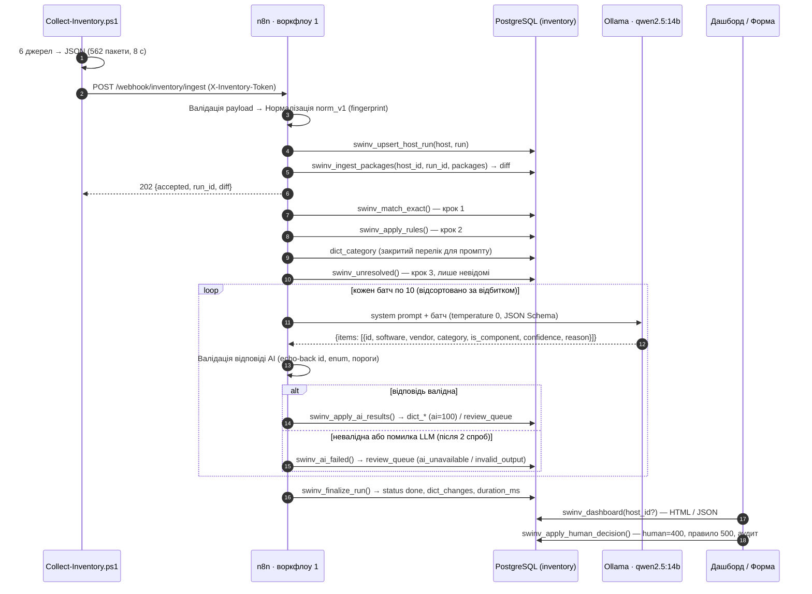

# SWInv — архітектура

Стисла технічна довідка: компоненти, контракти, послідовність обробки, прийняті рішення і точки розширення. Огляд, результати і «чому це прогнозовано» — у [README.md](../README.md); сценарій показу — у [DEMO.md](DEMO.md).

---

## 1. Компоненти та порти

| Компонент | Де працює | Порт / адреса | Роль |
|---|---|---|---|
| `collector/Collect-Inventory.ps1` | Робоча станція (PowerShell 5.1 / 7+) | → `http://<n8n>:5678/webhook/inventory/ingest` | Збір ПЗ із 6 джерел, нормалізація до контракту, файл + POST |
| n8n `2.37.10` (`swinv-n8n`) | Docker | `5678` | 5 воркфлоу: приймання/класифікація, форма перевірки, дашборд, обробка помилок, перекласифікація та звіт стабільності AI |
| PostgreSQL 16 (`swinv-postgres`) | Docker | `5432` (для psql з хоста); усередині мережі `postgres` | БД `n8n` (метадані n8n) і БД `inventory` (довідники, інвентар, функції `swinv_*`) |
| Ollama (`swinv-ollama`) | Docker + NVIDIA GPU | `11434`; усередині мережі `http://ollama:11434` | Локальна LLM `qwen2.5:14b`, `OLLAMA_KEEP_ALIVE=24h`, `OLLAMA_NUM_PARALLEL=1`, flash attention |

Volumes: `pg_data`, `n8n_data`, `ollama_models`. У n8n прокинуто `./n8n` (read-only) і дозволено читати `$env.INVENTORY_WEBHOOK_TOKEN`, `$env.OLLAMA_MODEL` з Code-нод (`N8N_BLOCK_ENV_ACCESS_IN_NODE=false`).

Credentials n8n з фіксованими id (`n8n/credentials/credentials.template.json`, значення підставляє `setup.ps1` з `.env`):

| id | Тип | Призначення |
|---|---|---|
| `swinvPostgres01` | postgres | БД `inventory`, хост `postgres` |
| `swinvOllama0001` | ollamaApi | `http://ollama:11434` |
| `swinvWebhookTok` | httpHeaderAuth | заголовок `X-Inventory-Token` |

Воркфлоу з фіксованими id (потрібні для CLI-імпорту й перехресних посилань): `swinvIngest00001`, `swinvReview00001`, `swinvDashbrd0001`, `swinvErrors00001`. Воркфлоу 1–3 мають `errorWorkflow = swinvErrors00001`; у воркфлоу 1 `executionTimeout = 1800` с.

---

## 2. Контракти

### 2.1 Payload колектора → webhook

Повний опис: [CONTRACT-collector.md](CONTRACT-collector.md). Коротко:

```
POST /webhook/inventory/ingest
Content-Type: application/json; charset=utf-8
X-Inventory-Token: <INVENTORY_WEBHOOK_TOKEN>

{
  "schema_version": "1.0",
  "run_id": "<uuid, новий на кожен запуск>",
  "collected_at": "<ISO-8601 з offset>",
  "collector": { "name": "Collect-Inventory.ps1", "version": "1.0.0" },
  "host": { "hostname", "domain", "machine_id", "os_name", "os_version", "os_build", "os_arch", "user", "manufacturer", "model", "serial" },
  "sources": [ { "name", "ok", "count", "duration_ms", "error", "stats" } ],   // завжди 6 рядків, навіть якщо джерело впало
  "packages": [ { "source", "source_key", "scope", "arch", "name", "version", "publisher", "install_date",
                  "install_location", "size_kb", "is_system_component", "is_framework", "uninstall_string",
                  "winget_id", "winget_source", "winget_available_version", "raw" } ]
}
```

`source_key` стабільний між запусками на тому самому хості: `HKLM64\<key>` / `HKLM32\<key>` / `HKCU\<key>`, `PackageFullName`, `<winget Id>`, `npm:<name>`, `pip:<name>`, `vscode:<publisher.ext>`. UTF-8 без BOM (є кирилиця в назвах).

Відповіді webhook:

| Код | Коли | Тіло |
|---|---|---|
| `202 Accepted` | payload валідний, знімок записано | `{ "accepted": true, "run_id", "host_id", "diff": { "packages_total", "added", "changed", "removed", "unchanged" }, "note" }` |
| `403` | немає/хибний `X-Inventory-Token` | стандартна відповідь n8n Header Auth |
| помилка виконання | невалідний payload (`Валідація payload` кидає виняток) | фіксується воркфлоу 4 у `audit_log` |

### 2.2 Функції БД (`db/schema.sql`)

Кожна нода Postgres у воркфлоу викликає рівно одну функцію одним `SELECT`; параметри передаються масивом (`options.queryReplacement`), масиви пакетів — як `jsonb` через `jsonb_to_recordset`.

| Функція | Призначення |
|---|---|
| `swinv_key(text)` | Ключ продукту з назви: lower, без ™®©, стиснуті пробіли |
| `swinv_vendor_key(text)` | Ключ вендора без організаційно-правових суфіксів і пунктуації; дзеркало `vendorKey()` у `normalize.js` |
| `swinv_regex_escape(text)` | Екранування назви для правила точного збігу |
| `swinv_priority(match_type)` | human 400 · seed 350 · rule 300 · exact 200 · ai 100 |
| `swinv_set_actor(actor, run_id)` | Актор і запуск на час транзакції для тригера аудиту |
| `swinv_vendor_id(name, created_by)` | Знайти вендора за ключем/аліасом або створити |
| `swinv_audit_trigger()` | Тригер `trg_audit_*` на всіх `dict_*`: пише `old_row`/`new_row`/`actor`/`run_id`, ігнорує волатильні колонки |
| `swinv_touch_updated_at()` | Тригер `trg_touch_*`: `updated_at = now()` |
| `swinv_upsert_host_run(host jsonb, run jsonb)` | Upsert хоста за `machine_id`, створення запуску `received` |
| `swinv_ingest_packages(host_id, run_id, packages jsonb)` | Set-based upsert знімка, diff added/changed/removed/unchanged, зниклі → `present=false`, статус `classifying`, `fingerprints_total`, `known_before` |
| `swinv_match_exact(host_id, run_id)` | Крок 1: touch відомих відбитків; нові з `winget_id` відомого продукту → `exact` |
| `swinv_apply_rules(host_id, run_id)` | Крок 2: regex-правила за спаданням `priority`; вендор → продукт → зіставлення `rule`; `hit_count` |
| `swinv_unresolved(host_id)` | Крок 3: по одному зразку на нерозв'язаний відбиток; пропускає ті, що чекають на людину (`low_confidence`, `unknown_category`, `manual`), повторює технічні збої |
| `swinv_apply_ai_results(run_id, host_id, model, prompt_version, results jsonb)` | Запис перевіреного батчу: вендори/продукти/зіставлення `ai`, записи в чергу для `review`/`accept_review`, автозакриття старих технічних записів черги (`ai-retry`), лічильники `ai_calls`, `ai_packages`, `resolved_ai` |
| `swinv_ai_failed(run_id, host_id, batch jsonb, reason, error)` | Батч у чергу з `ai_unavailable` / `invalid_output`; `ai_batches_failed`; запуск не падає |
| `swinv_finalize_run(run_id)` | `unresolved`, `dict_changes` (= рядків аудиту з цим `run_id`), `duration_ms`, статус `done`, підсумковий JSON |
| `swinv_apply_human_decision(review_id, software, vendor, category, is_component, create_rule, actor)` | Рішення людини: продукт (може змінити категорію), зіставлення `human=400`, опційне правило `^назва$` з `priority 500`/`origin human`, закриття записів черги з цим відбитком |
| `swinv_dashboard(p_host_id int DEFAULT NULL)` | Один JSON для дашборду (NULL — увесь парк, інакше один хост; довідники, черга й аудит завжди спільні): перелік хостів із підсумками, зміни обраного хоста за останній збір, KPI, 12 останніх запусків, розподіл рішень, категорії з політиками, порушення, топ продуктів, черга, аудит, правила, джерела, вендори |
| `swinv_reclassify(p_host_id, p_reset_ai, p_prompt_version)` | Перекласифікація заднім числом: поточні правила до всіх відбитків парку (перекривають лише ai/exact); за `reset_ai` — видалення рішень AI (усіх або зі старим `prompt_version`) з фіксацією в аудиті, повторний запит моделі при наступному зборі. Викликається воркфлоу 5 і автоматично після рішення людини з формою (створене правило) |
| `swinv_ai_consistency_report()` | Порівняння скинутих рішень AI (audit_log) з новими для тих самих відбитків: частка однакових продуктів і категорій, перелік розбіжностей |

Подання: `v_inventory_current` → `v_software_by_host` → `v_policy_violations` (`policy IN ('prohibited','restricted')`, з урахуванням `dict_software.policy_override`).

### 2.3 Таксономія (`db/seed.sql`) і політики

| Код | Назва | Політика |
|---|---|---|
| `OS_COMPONENT` | Компоненти та вбудовані застосунки Windows | allowed |
| `RUNTIME` | Середовища виконання та бібліотеки | allowed |
| `DRIVER` | Драйвери та утиліти пристроїв | allowed |
| `DEV_TOOLS` | Інструменти розробки | allowed |
| `DATABASE` | СУБД та інструменти роботи з БД | allowed |
| `VIRTUALIZATION` | Віртуалізація та контейнери | allowed |
| `OFFICE` | Офісні застосунки та документи | allowed |
| `BROWSER` | Браузери | allowed |
| `COMMUNICATION` | Комунікації та месенджери | **restricted** |
| `SECURITY` | Безпека та захист | allowed |
| `SYSTEM_UTILITY` | Системні утиліти | allowed |
| `MEDIA` | Медіа та графіка | allowed |
| `REMOTE_ACCESS` | Віддалений доступ та VPN | **restricted** |
| `CLOUD_STORAGE` | Хмарні сховища та синхронізація | **restricted** |
| `AI_ASSISTANT` | AI-асистенти та LLM-клієнти | **restricted** |
| `GAMES` | Ігри та ігрові платформи | **prohibited** |
| `OTHER` | Інше | allowed (відповідь AI `OTHER` завжди йде на перевірку) |

`UNKNOWN` — не категорія довідника, а дозволене значення в JSON Schema відповіді моделі: «не можу визначити» → черга з причиною `unknown_category`.

### 2.4 Довідкові переліки

| Поле | Значення |
|---|---|
| `dict_package_map.match_type` / пріоритет | `human` 400 · `seed` 350 · `rule` 300 · `exact` 200 · `ai` 100 |
| `review_queue.reason` | `low_confidence` · `unknown_category` · `invalid_output` · `ai_unavailable` · `manual` |
| `review_queue.status` | `open` · `resolved` · `dismissed` |
| `inventory_runs.status` | `received` → `classifying` → `done` / `error` |
| Рішення валідатора AI | `accept` (≥ 0.80) · `accept_review` (0.60–0.80: записати і показати людині) · `review` (< 0.60, `OTHER`, невідомий код, порожня назва, немає відповіді) |
| Параметри моделі | `qwen2.5:14b`, `temperature 0`, `topK 1`, `format json`, `numCtx 8192`, `numPredict 2048`, `keepAlive 24h`; батч 10; `prompt_version p1`; retry 2× з паузою 3 с |

---

## 3. Послідовність обробки



Час на тестовому ПК: відповідь колектору ~0,35 с; кроки 1–2 ≈ 1 с; AI ≈ 9 с на батч; перший запуск 73 с, усі наступні без нового ПЗ — 1–2 с.

---

## 4. Рішення та компроміси

**Логіка довідників — у функціях Postgres, n8n — оркестратор.**
Плюси: атомарність кроку (одна транзакція, або все, або нічого), set-based швидкість (562 пакети одним `INSERT … ON CONFLICT`), тестованість у psql без n8n, версіонування в git, аудит-тригер, який не залежить від того, хто пише в таблицю. Компроміс: частина логіки не видна «на канвасі» — компенсовано тим, що кожна SQL-нода називається по кроку і містить один `SELECT swinv_…()`, а sticky-нотатки описують смуги.

**Закрита таксономія замість вільних категорій від AI.**
Категорія — управлінська сутність (політика, звітність), її мусить контролювати людина. Модель обирає з переліку або каже `UNKNOWN`. Ціна — нову категорію треба додати свідомо; це і є бажана поведінка для банку.

**Категорія на продукті, а не на пакеті.**
Пакет → продукт (`dict_package_map`), продукт → категорія (`dict_software`). 23 пакети VC++ мають одну категорію за визначенням, а виправлення категорії продукту людиною одразу діє на всі його пакети на всіх хостах.

**Локальна LLM.**
Дані про ПЗ робочих станцій не залишають периметр; вартість звернень не залежить від зовнішнього провайдера; `keepAlive 24h` тримає модель у GPU. Компроміс — якість 14B-моделі нижча за топові хмарні; компенсовано валідатором, порогами, чергою і тим, що AI бачить лише залишок після правил. Заміна моделі — одна нода (`OpenAI Chat Model` уже на канвасі, вимкнена).

**Статичний `enum` у JSON Schema + динамічний валідатор.**
Structured Output Parser у n8n приймає схему як рядок у JSON воркфлоу і не може читати БД під час виконання. Тому `enum` кодів зашитий у `CATEGORY_CODES` (`build_workflows.py`) і обмежує модель на етапі декодування, а нода `Валідація відповіді AI` перевіряє код проти живого `dict_category`. Категорія, додана лише в БД, не пройде парсер — батч піде в чергу (безпечна відмова). Тому нова категорія = SQL + `CATEGORY_CODES` + перегенерація (розділ 5).

**Пріоритети замість «останній переміг».**
`ON CONFLICT … WHERE EXCLUDED.priority >= dict_package_map.priority` робить порядок виконання кроків несуттєвим для результату: людина > seed > правило > точний збіг > AI, незалежно від того, хто прийшов пізніше.

**Відбиток без версії.**
Версії змінюються щотижня; продукт — ні. Версія лишається на пакеті (`version`, `version_prev`, `changed_at`), а рішення довідника прив'язане до відбитка. Ризик — дві різні програми з однаковою нормалізованою назвою й вендором зіллються; на практиці не зустрілось, а людина може розвести їх правилом за `source_key`.

**Асинхронна відповідь колектору.**
Колектор отримує `202` через ~0,35 с, класифікація триває окремо. Це дозволяє запускати колектор як scheduled task без довгих таймаутів; статус запуску — в `inventory_runs`.

**Генератор воркфлоу замість ручного JSON.**
`build_workflows.py` вставляє `normalize.js` і `dashboard.js` з одного джерела, коректно екранує JS у Code-нодах і рахує координати. Правити воркфлоу можна й у редакторі n8n, але джерелом істини в репозиторії є генератор.

---

## 5. Як розширювати

**Нова категорія.**
1. `INSERT INTO dict_category (code, name_uk, name_en, description, policy, sort_order) VALUES ('FINANCE', 'Фінансові застосунки', 'Finance apps', '…', 'restricted', 155);` — одразу з'являється у промпті (`Довідник категорій`), у формі та на дашборді, її можна використовувати в правилах.
2. Додати `'FINANCE'` у `CATEGORY_CODES` в `n8n/build_workflows.py`, виконати `python n8n/build_workflows.py`, потім `setup.ps1` (повторний імпорт воркфлоу — upsert за id) або імпорт `n8n/workflows/01-ingest-classify.json` вручну.

**Нове правило.**
```sql
INSERT INTO dict_rules (name, field, pattern, software_name, vendor_name, category_code, is_component, priority, origin)
VALUES ('Клієнт-банк X', 'name', '^Клієнт-банк X', 'Клієнт-банк X', 'Вендор', 'OFFICE', false, 200, 'seed');
```
Перевірити regex заздалегідь: `SELECT name FROM inventory_packages WHERE present AND name ~* '^Клієнт-банк X';`. Правило застосується до **нерозв'язаних** відбитків при наступному запуску. Щоб перекрити вже прийняті рішення AI цим правилом — видалити відповідні рядки `dict_package_map` з `match_type = 'ai'` (людські рішення чіпати не треба: у них пріоритет вищий). Вимкнути правило — `enabled = false`.

**Нове джерело даних (наприклад, Chocolatey або розширення браузера).**
1. Колектор: додати функцію збору, яка повертає пакети з `source = 'choco'` і стабільним `source_key` (`choco:<id>`), і зареєструвати її в `$script:SourceOrder`; зафіксувати правило `source_key` у `docs/CONTRACT-collector.md`.
2. `n8n/code/normalize.js`: якщо джерело має стабільний id — додати гілку у `fingerprint()` (як для `npm`/`pip`/`vscode`), інакше спрацює загальна `source|назва|вендор`. Після зміни — `python n8n/build_workflows.py` і реімпорт.
3. За потреби seed-правило за `field = 'source'` (як `Пакети розробника (npm / pip)`).

**Інший LLM.**
Будь-яка нода типу `lmChat*` (OpenAI, Azure OpenAI, Anthropic, Mistral, інший Ollama-хост) під'єднується до входу `Model` ноди `AI: класифікація (Basic LLM Chain)`. Зберегти `temperature 0` і JSON-вивід; промпт, схема, валідатор і пороги не змінюються. Модель фіксується в `dict_package_map.model` — старі рішення лишаються відстежуваними. Для переоцінки: змінити `PROMPT_VERSION`, перегенерувати воркфлоу, видалити рішення `ai` зі старим `prompt_version` — наступний запуск перекласифікує лише їх.

**Новий хост.**
Нічого налаштовувати не треба: `Collect-Inventory.ps1 -WebhookUrl http://<n8n>:5678/webhook/inventory/ingest -Token <токен>`. Хост створюється за `machine_id`, довідники спільні, дашборд групує по хостах.

**Зміна політики.**
`UPDATE dict_category SET policy = 'prohibited' WHERE code = 'CLOUD_STORAGE';` або для одного продукту `UPDATE dict_software SET policy_override = 'allowed' WHERE name = 'Microsoft OneDrive';` — обидві зміни аудитуються, подання `v_policy_violations` і дашборд оновлюються миттєво.

### Воркфлоу 5 · Перекласифікація та стабільність AI
`POST /webhook/inventory/reclassify` (Header Auth; body `{host_id?, reset_ai?, prompt_version?}`) → `swinv_reclassify` → JSON-підсумок; `GET /webhook/inventory/api/consistency` → `swinv_ai_consistency_report`. Закриває «коректне оновлення довідників» для накопичених рішень: нове правило або рішення людини виправляють минуле, а не лише майбутнє.

## 6. Кросплатформність

| Компонент | Windows | Linux / macOS |
|---|---|---|
| Колектор | `collector/Collect-Inventory.ps1` (PowerShell 5.1+): registry, appx, winget, npm, pip, vscode | `collector/collect-inventory.sh` (bash 3.2+): dpkg, rpm, apk, pacman, snap, flatpak, brew, brew-cask, macos-app, pip, npm, vscode |
| Bootstrap стенду | `setup.ps1`, `reset.ps1` | `setup.sh` (`--reset`, `--skip-model-pull`, `--skip-smoke`) |
| GPU для Ollama | `docker-compose.gpu.yml` через `COMPOSE_FILE` у `.env` (NVIDIA, Docker Desktop/WSL2) | те саме на Linux з nvidia-container-toolkit; на macOS — нативний Ollama і `OLLAMA_BASE_URL=http://host.docker.internal:11434` |
| Контракт, БД, воркфлоу, дашборд | спільні | спільні |

Обидва колектори формують однаковий payload (`docs/CONTRACT-collector.md`), тому хости різних ОС потрапляють в один реєстр зі спільними довідниками: відбиток `dpkg|git|…` на другому Linux-хості вже буде відомим. Для пакетів дистрибутивів діє seed-правило «Linux: пакети дистрибутива (catch-all)» → `OS_COMPONENT` (пріоритет 40), а відомі сервери БД, інструменти розробки, контейнери, VPN, браузери тощо мають окремі правила з вищим пріоритетом; решта (snap, flatpak, cask, застосунки macOS) — до AI за тим самим промптом і валідатором. Перевірка: контейнер `ubuntu:22.04` — 116 пакетів dpkg, 116 закрито правилами, 0 звернень до AI, 0,6 с.
